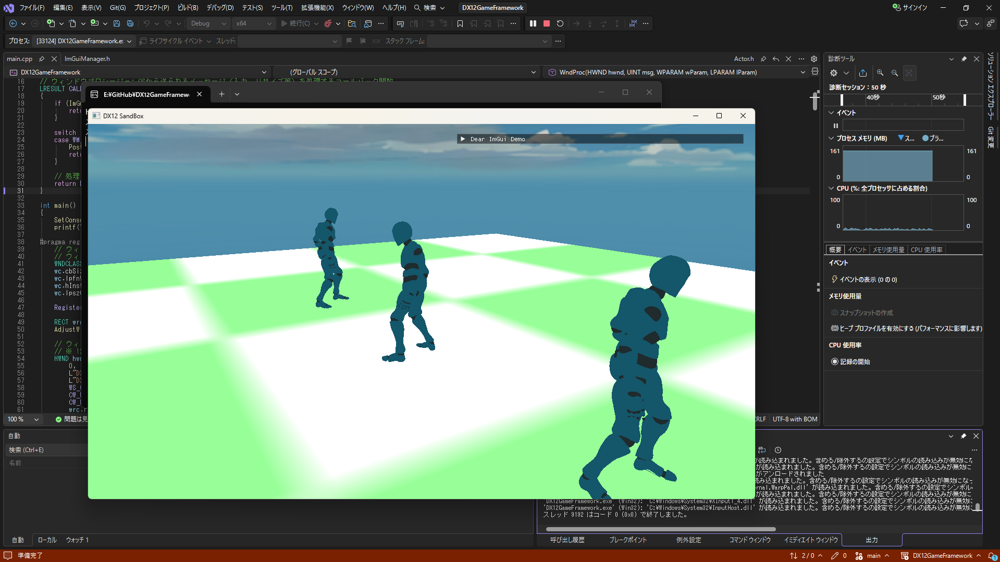

# DX12-GameFramework 
## 概要
DirectX 12の基礎を学習し、独自のフレームワークを構築することを目的としたプロジェクトです。
単に画面にモデルを描画するだけでなく、「ゲームを作るための基盤」として利用できるものを目標にしています。

## 実装機能
### DirectX 12の低レイヤー制御
- DeviceやCommandQueueなどの初期化からRoot Signatureの設定等、APIの初期化・描画パイプラインを構築

### フレームワーク
- コンポーネント指向の採用
- Timeクラスを実装し、フレームレートに依存しない制御
- デバッグUI

### 3Dグラフィックス
- FBX等のモデル描画
- スケルタルアニメーション
- スカイボックス表現

## 使用技術
- 言語: C++20, HLSL
- グラフィックスAPI: DirectX 12     
- 主要ライブラリ:
&#x20;      - Assimp https://github.com/assimp/assimp (3Dモデル読み込み)
&#x20;      - Dear ImGui https://github.com/ocornut/imgui (デバッグ用UI)
&#x20;      - stb\_image https://github.com/nothings/stb (テクスチャ読み込み）
## 今後実装していくもの
- [ ] スカイボックスのコードを専用クラスとしてまとめる
- [ ] PipelineManager の構築によるマルチシェーダー管理
- [ ] ライティングの実装
- [ ] ポストエフェクトの実装
- [ ] 
## ビルド手順
1. Visual Studio 2022 (または2019) を用意します。
2. Windows 10/11 SDK がインストールされていることを確認します。
3. DX12GameFramework.sln を開きます。
4. ※(必要に応じて) vcpkg等で assimp をインストールしてください。
5. ビルドして実行します。

